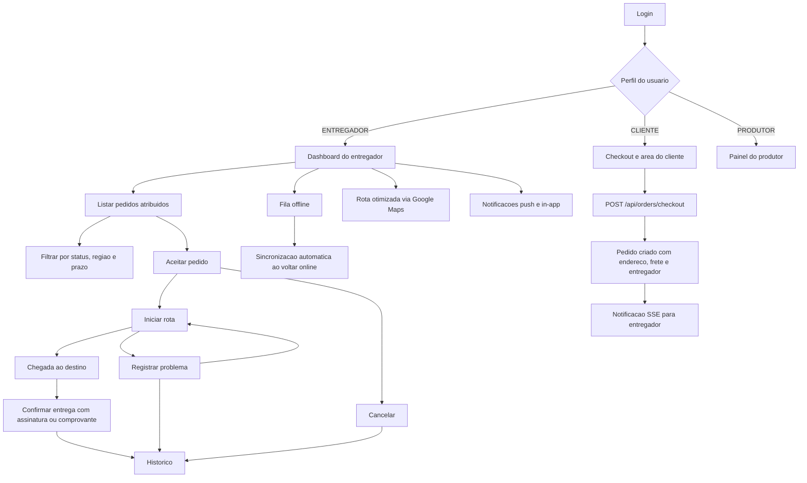

# Modulo de Entregadores

## Visao Geral

Este modulo adiciona um fluxo dedicado para perfis `ENTREGADOR`, integrado ao dominio de `Pedido` ja existente no sistema. O objetivo e operar todo o ciclo logistico da entrega sem criar uma entidade paralela desconectada do checkout.

## Fluxo de Telas

## Componentes Implementados

- `PapelUsuario.ENTREGADOR`: habilita autenticacao e redirecionamento exclusivo para entregadores.
- `StatusEntrega`: enum central da operacao logistica.
- `Pedido`: recebe campos de entregador, endereco logistica, prazo, eventos da rota, comprovante, assinatura e ocorrencia.
- `PedidoService`: concentra criacao de pedidos no checkout, listagem filtrada do entregador, atualizacao de status e notificacoes em tempo real.
- `EntregadorNotificationService`: canal SSE para sincronizacao instantanea.
- `EntregadorController`: entrega as views `delivery/dashboard` e `delivery/history`.
- `EntregadorApiController`: expone consulta de pedidos, atualizacao de status e stream SSE.
- `PedidoCheckoutApiController`: transforma o checkout em criacao real de `Pedido`.
- `deliveryDashboard.js`: filtros, KPIs, navegação, fila offline, SSE, push notifications e acao por status.
- `deliveryHistory.js`: historico operacional com cliente, datas, frete e ocorrencias.
- `deliveryOfflineQueue.js`: persistencia local de acoes de entrega para reconciliação futura.

## Regras Operacionais

- `PENDENTE -> ACEITO | CANCELADO`
- `ACEITO -> EM_ROTA | CANCELADO`
- `EM_ROTA -> CHEGOU_DESTINO | PROBLEMA | CANCELADO`
- `CHEGOU_DESTINO -> ENTREGUE | PROBLEMA | CANCELADO`
- `PROBLEMA -> EM_ROTA | CANCELADO`
- `ENTREGUE` e `CANCELADO` encerram a operacao

## Recursos de UX e Mobile

- Dashboard mobile-first com cards de entrega e acoes de toque rapido.
- Filtros por status, regiao e prazo diretamente no topo da tela.
- Rota otimizada para entregas sequenciais via Google Maps.
- Indicador de conectividade e sincronizacao offline/online.
- Feedback in-app via toast e notificacoes do navegador.

## Persistencia Offline

- Acoes de status sao armazenadas em `localStorage` pela chave `farmfood_delivery_offline_queue`.
- Quando a conexao volta, o dashboard drena a fila e reenvia cada acao para `/delivery/api/pedidos/{id}/status`.

## Dados Iniciais

O `DataInitializer` passa a criar, quando o banco estiver vazio:

- um produtor de exemplo
- um cliente de exemplo
- um entregador de exemplo
- uma loja com produtos
- um endereco salvo
- pedidos em estados `PENDENTE`, `EM_ROTA` e `ENTREGUE`

## Validacao Recomendada

- Login com usuario entregador e redirecionamento para `/delivery/dashboard`
- Finalizacao de compra em `/checkout` criando pedidos reais
- Recebimento de novo pedido no dashboard do entregador
- Mudanca de status sequencial ate `ENTREGUE`
- Registro de problema e retomada de entrega
- Consulta do historico em `/delivery/history`
- Teste offline: desligar rede, atualizar status, religar rede e sincronizar

## Testes Automatizados

Arquivo criado:

- `src/test/java/com/foodfarmer/foodfarmer/service/PedidoServiceTest.java`

Cenarios cobertos:

- criacao de pedido no checkout com atribuicao de entregador
- filtros do historico/listagem do entregador
- atualizacao de status para entrega concluida
- bloqueio de atualizacao por entregador nao responsavel

## Observacoes de Operacao

- O ambiente atual desta sessao nao possui `mvn` configurado globalmente nem `mvnw`, entao a validacao automatica completa depende da execucao via IDE ou da reinstalacao do Maven no projeto.
- O modulo foi implementado de forma isolada sobre `Pedido`, reduzindo impacto sobre fluxos de cliente e produtor.
